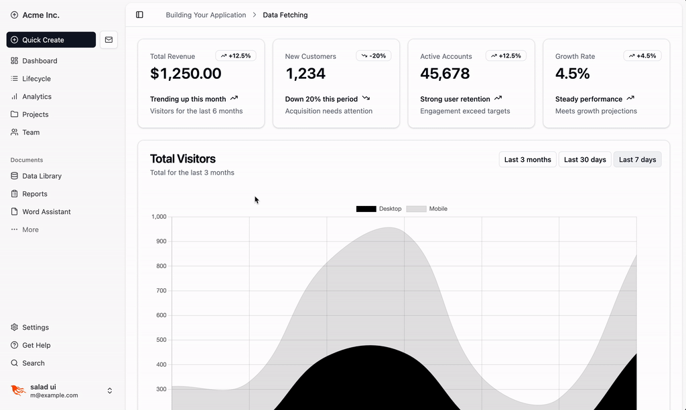

<p align="center">
    <a href="https://salad-storybook.fly.dev/" alt="SaladUI Logo">
    </a>
</p>
<h4 align="center">
    A collection of Live View components inspired by shadcn
</h4>

<div align="center">
    <a href="https://salad-storybook.fly.dev/">Demo</a> |
    <a href="https://hexdocs.pm/salad_ui/readme.html">Documentation</a> |
    <a href="https://ko-fi.com/bluzky">Support project</a>
</div>
<br></br>

<div align="center">

<a href="https://hex.pm/packages/salad_ui"></a>
<a href="https://hexdocs.pm/salad_ui/"></a>
<a href="https://hex.pm/packages/salad_ui"></a>
<a href="https://github.com/bluzky/salad_ui/commits/main"></a>
</div>



## 🚧 V1 is now beta release

## [Demo storybook v1](https://salad-storybook.fly.dev/)

<a href='https://ko-fi.com/F1F1CEZ91' target='_blank'></a>

## Installation

1. Add `salad_ui` to your `mix.exs`

```elixir
def deps do
  [
    {:salad_ui, "~> 1.0.0-beta.2"},
  ]
end
```

2. Choose your installation method:

### Method 1: Quick Setup (Using as Library)

For a quick start with minimal configuration:

```bash
mix salad.setup
```

This sets up SaladUI to use components directly from the library. You can start using components immediately:

```elixir
defmodule MyAppWeb.PageLive do
  use MyAppWeb, :live_view
  import SaladUI.Button
  import SaladUI.Dialog

  def render(_) do
    ~H"""
    <.button>Click me</.button>
    <.dialog id="my-dialog">
      <.dialog_content>
        <p>Hello world!</p>
      </.dialog_content>
    </.dialog>
    """
  end
end
```

### Method 2: Local Installation (Customizable)

For full customization with local component files:

```bash
# Default installation
mix salad.install

# With custom prefix and color scheme
mix salad.install --prefix MyUI --color-scheme slate
```

This copies all component files to your project under `lib/my_app_web/components/ui/` where you can customize them:

```elixir
defmodule MyAppWeb.PageLive do
  use MyAppWeb, :live_view
  import MyAppWeb.Components.UI.Button
  import MyAppWeb.Components.UI.Dialog

  def render(_) do
    ~H"""
    <.button>Click me</.button>
    <.dialog id="my-dialog">
      <.dialog_content>
        <p>Hello world!</p>
      </.dialog_content>
    </.dialog>
    """
  end
end
```

## What Each Method Does

### `mix salad.setup`
- ✅ Sets up Tailwind CSS and color schemes
- ✅ Configures JavaScript hooks and components
- ✅ Ready to use immediately
- ❌ Components cannot be customized
- ❌ Uses external package dependencies

### `mix salad.install`
- ✅ Sets up Tailwind CSS and color schemes
- ✅ Copies all component source code locally
- ✅ Copies all JavaScript files locally
- ✅ Full customization possible
- ✅ No external runtime dependencies
- ✅ Custom module prefixes

## More configuration

1. Custom error translate function

```elixir
config :salad_ui, :error_translator_function, {MyAppWeb.CoreComponents, :translate_error}
```


## 🛠️ Development

Here is how to start develop SaladUI on local machine.

1. Clone this repo
2. Go into storybook folder
3. Start storybook

```
cd storybook
mix phx.server
```

## Unit Testing

All v1 component are not covered by UnitTest. Currently I'm working on an important project so I don't have much time for this. If you're interested in this project, please help to add Unit Test if possible. 🙏

## List of components

| Component      | v0   | v1   |
|----------------|------|------|
| Accordion      | ✅    | ✅    |
| Alert          | ✅    | ✅     |
| Alert Dialog   | ✅    | ✅    |
| Avatar         | ✅    | ✅     |
| Badge          | ✅    | ✅     |
| Breadcrumb     | ✅    | ✅     |
| Button         | ✅    | ✅     |
| Card           | ✅    | ✅     |
| Carousel       | ❌    |      |
| Checkbox       | ✅    | ✅     |
| Collapsible    | ✅    | ✅    |
| Combobox       | ❌    |      |
| Command        | ❌    | ✅ [@ilyabayel](https://github.com/ilyabayel)     |
| Context Menu   | ❌    |      |
| Dialog         | ✅    | ✅     |
| Drawer         | ❌    |      |
| Dropdown Menu  | ✅    | ✅     |
| Form           | ✅    | ✅     |
| Hover Card     | ✅    | ✅      |
| Input          | ✅    | ✅     |
| Input OTP      | ❌    |      |
| Label          | ✅    | ✅      |
| Pagination     | ✅    | ✅     |
| Popover        | ✅    | ✅     |
| Progress       | ✅    | ✅    |
| Radio Group    | ✅    | ✅     |
| Scroll Area    | ✅    | ✅    |
| Select         | ✅    | ✅     |
| Separator      | ✅    | ✅     |
| Sheet          | ✅    | ✅     |
| Skeleton       | ✅    | ✅     |
| Slider         | ✅    | ✅     |
| Switch         | ✅    | ✅   |
| Table          | ✅    | ✅    |
| Tabs           | ✅    | ✅     |
| Textarea       | ✅    | ✅     |
| Tooltip        | ✅    | ✅    |

## 🌟 Contributors

<p align="center">
    <a href="https://github.com/bluzky/salad_ui/graphs/contributors">
        </a>
</p>

## 😘 Credits

This project could not be available without these awesome works:

- `tailwind css` an awesome css utility project
- `turboprop` I borrow code from here for merging tailwinds classes
- `shadcn/ui` which this project is inspired from
- `Phoenix Framework` of course
