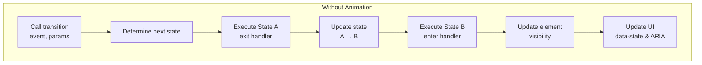

# Transition Execution flow

Here is execution flow for transtion with and without animation

## Without animation

## With animation

```mermaid
flowchart TD
    subgraph "With Animation"
        AA[Call transition\nevent, params] --> BB[Determine next state]
        BB --> CC[Check for animation config]
        CC --> DD[Execute State A\nexit handler]
        DD --> EE[Update state\nA → B]
        EE --> FF[Apply animation\nstart classes]
        FF --> GG[Apply animation\nrun classes]
        GG --> HH[Apply animation\nend classes]
        HH --> II[Wait for\nanimation duration]
        II --> JJ[Execute State B\nenter handler]
        JJ --> KK[Update element\nvisibility]
        KK --> LL[Update UI\ndata-state & ARIA]
    end
```

- Update visibility after animation to make sure the component is still visible during transition from open to closed.
