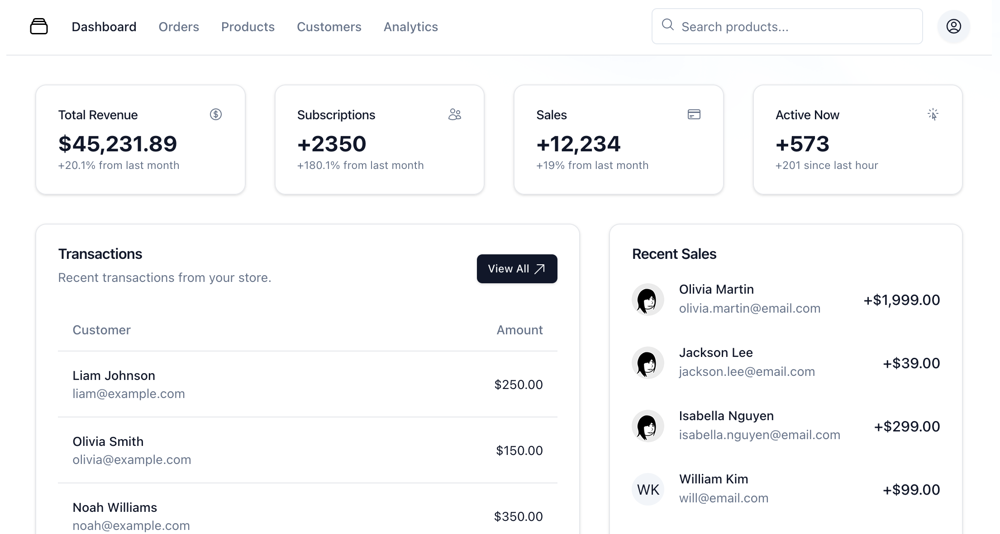

# SaladStorybook




> Salad UI is a collection of phoenix live view component inspired by [shadui](https://ui.shadcn.com/)
> Currently these components are under heavy development and cannot be used as separated library.

### [Demo](https://salad-storybook.fly.dev/)

## How to start Story book.

1. Clone this repository

2. Clone https://github.com/bluzky/salad_ui at the same directory with this repo

3. Install node modules

`cd assets && yarn`

4. Install dependency & start
```
mix deps.get
mix phx.server
```

Now you can visit [`localhost:4000`](http://localhost:4000) from your browser.

## List of components

| Component      | v0   | v1   |
|----------------|------|------|
| Accordion      | ✅    |      |
| Alert          | ✅    | ✅     |
| Alert Dialog   | ✅    |      |
| Avatar         | ✅    | ✅     |
| Badge          | ✅    | ✅     |
| Breadcrumb     | ✅    | ✅     |
| Button         | ✅    | ✅     |
| Card           | ✅    | ✅     |
| Carousel       | ❌    |      |
| Checkbox       | ✅    |      |
| Collapsible    | ✅    |      |
| Combobox       | ❌    |      |
| Command        | ❌    |      |
| Context Menu   | ❌    |      |
| Dialog         | ✅    | ✅     |
| Drawer         | ❌    |      |
| Dropdown Menu  | ✅    |      |
| Form           | ✅    |      |
| Hover Card     | ✅    | ✅      |
| Input          | ✅    |      |
| Input OTP      | ❌    |      |
| Label          | ✅    |      |
| Pagination     | ✅    |      |
| Popover        | ✅    | ✅     |
| Progress       | ✅    |      |
| Radio Group    | ✅    |      |
| Scroll Area    | ✅    |      |
| Select         | ✅    | ✅     |
| Separator      | ✅    |      |
| Sheet          | ✅    |      |
| Skeleton       | ✅    |      |
| Slider         | ✅    |      |
| Switch         | ✅    |      |
| Table          | ✅    |      |
| Tabs           | ✅    | ✅     |
| Textarea       | ✅    |      |
| Tooltip        | ✅    |      |
